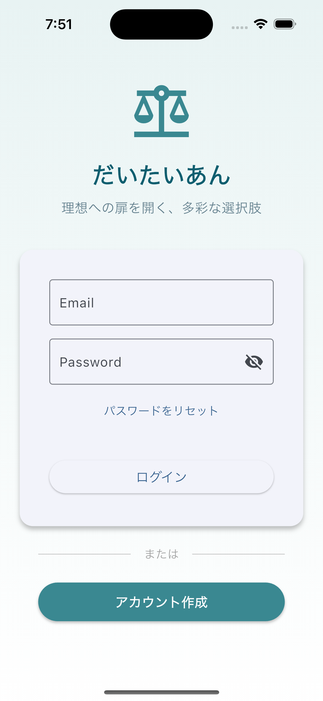
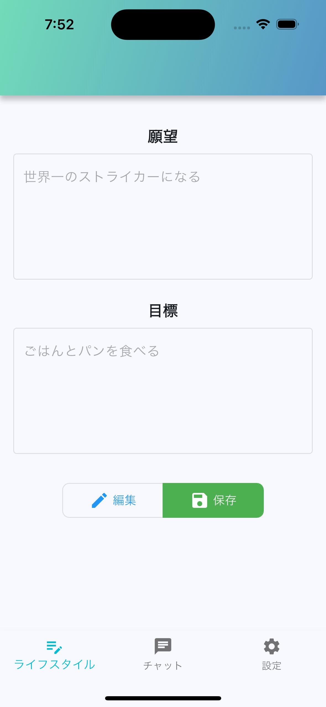
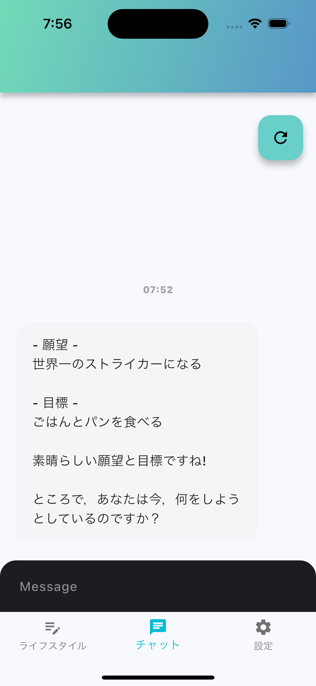

# 個人開発アプリ 「だいたいあん」
[](https://pub.dev/packages/very_good_analysis)

[](https://apps.apple.com/jp/app/%E3%81%A0%E3%81%84%E3%81%9F%E3%81%84%E3%81%82%E3%82%93/id6742693704)

## 🌟 開発背景

値引きや増量キャンペーンを見かけると、つい、その商品を買ってしまう。そんな日常に嫌気がさしていませんか？

確かにその瞬間は幸せかもしれませんが、後で振り返ると「間違った選択だった」と思うことも多いでしょう。少なくとも、将来の理想の自分に近づくという目標からは遠ざかってしまっています。時間とお金という投資リソースは有限であり、できる限り自分の理想へ投資したいものです。**そんな理想的な行動選択を支援するアプリを開発しようと考えました。**

## 📱 プロジェクト概要

**だいたいあん** は、無駄遣いや不摂生に走りがちな現代人のために、理想的な行動選択を支援するAIエージェントアプリです。

### 🎯 解決したい課題
- 衝動的な消費行動の抑制
- 健康的なライフスタイルの維持
- 理想の自分との行動ギャップの解消

### 💡 アプローチ
- AIによる個人に最適化された提案
- 継続的な対話を通じた行動パターンの学習
- ユーザーフレンドリーなチャット形式のインターフェース

## ✨ 主な機能

### 🔐 認証機能
- メールアドレス・パスワードによるユーザー登録・ログイン
- パスワードリセット機能
- ゲストモード（お試し利用）
- アカウント削除機能

### 🤖 AI対話機能
- パーソナライズされたAIエージェントとの対話
- ライフスタイル情報を基にした提案生成
- 継続的な学習による提案精度の向上

### 📊 ライフスタイル管理
- ユーザープロファイルの設定・管理
- 行動履歴の記録・分析(開発中)

## 🛠 技術スタック

### Frontend
- **Flutter** - モバイルアプリ開発フレームワーク

### Backend
- **Node.js** - JavaScript実行環境
- **Express.js** - Webアプリケーションフレームワーク
- **Google Genkit** - AI統合

## 🏗 アーキテクチャ

```
lib/
├── main.dart                 # アプリケーションエントリーポイント
├── firebase_options.dart     # Firebase設定
├── enums/                    # 列挙型定義
│   └── tab_item.dart
├── models/                   # データモデル
│   ├── lifestyle.dart
│   └── user.dart
├── pages/                    # 画面コンポーネント
│   ├── base_page.dart
│   ├── chat_room_page.dart
│   ├── lifestyle_page.dart
│   ├── login_signup_page.dart
│   ├── setting_page.dart
│   └── signup_page.dart
├── providers/                # 状態管理
│   ├── lifestyle_provider.dart
│   └── user_provider.dart
├── services/                 # ビジネスロジック
│   ├── genkit_client.dart
│   ├── image_generation_service.dart
│   └── local_database.dart
├── utility/                  # ユーティリティ
└── widgets/                  # 再利用可能なUI部品

genkit/                       # AI統合バックエンド
├── src/
│   ├── app.ts               # Express サーバー
│   ├── genkit.ts            # Genkit設定
│   ├── index.ts             # エントリーポイント
│   └── genkit-flows/        # AIフロー定義
└── prompts/                 # プロンプト管理
```

### 設計パターン
- **Provider Pattern** - 状態管理とデータ流通
- **Repository Pattern** - データアクセス層の抽象化
- **Clean Architecture** - 関心の分離とテスタビリティ

## 🚀 開発における工夫・技術的チャレンジ

### 1. AIとの効果的な統合
- Google Genkitを活用したAI対話システムの構築
- ユーザーのライフスタイル情報を活用したコンテキスト生成
- プロンプトエンジニアリングによる提案品質の向上

### 2. ユーザー体験の最適化
- Firebase Authenticationによる安全で簡単な認証フロー
- ゲストモードによる機能試用の実現
- 直感的なチャットUIによる自然な対話体験

### 3. データ管理の効率化
- SQLiteによるローカルデータのキャッシュ戦略
- Providerパターンによる効率的な状態管理

### 4. 開発プロセスの改善
- Flutter Lintsによるコード品質の維持
- 環境別設定ファイルによる柔軟なデプロイ
- TypeScript + Node.jsによるバックエンド開発

## 📱 スクリーンショット

<div align="center">
  
  
  
</div>
