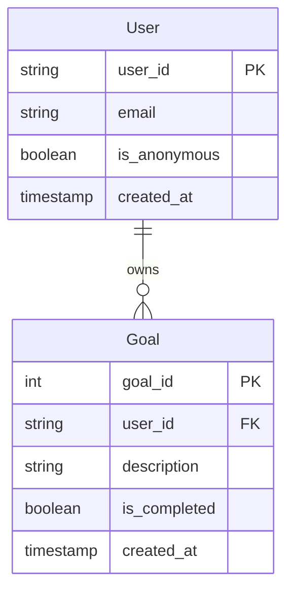

## Data model

```mermaid
erDiagram
    User {
        string user_id PK
        string email
        boolean is_anonymous
        timestamp created_at
    }

    Goal {
        int goal_id PK
        string user_id FK
        string description
        boolean is_completed
        timestamp created_at
    }

    User ||--o{ Goal : "owns"
```