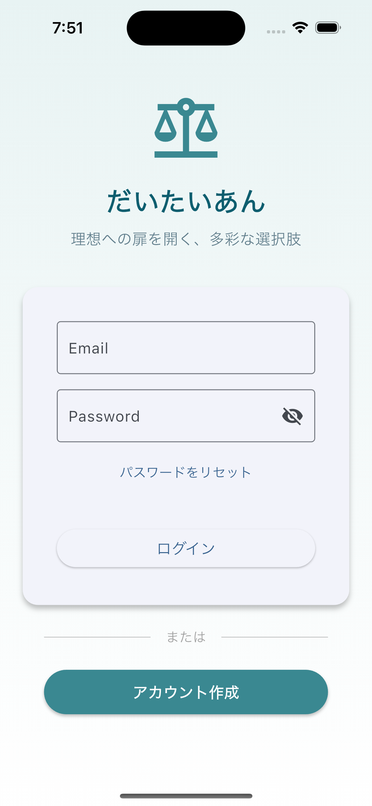
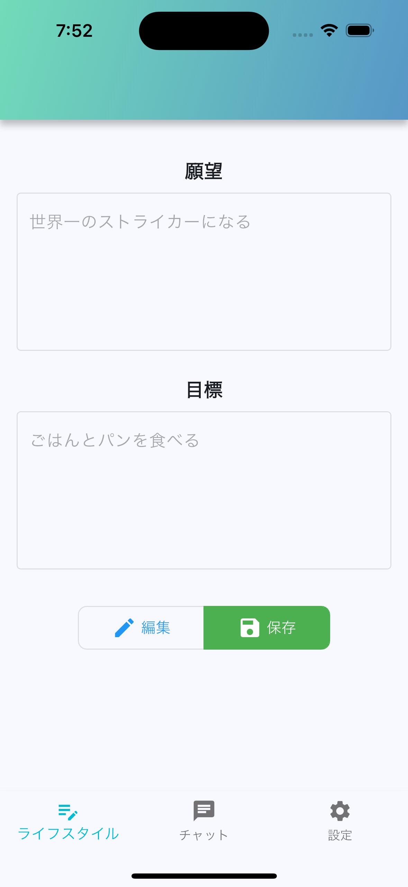
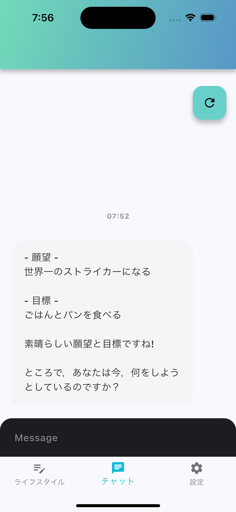
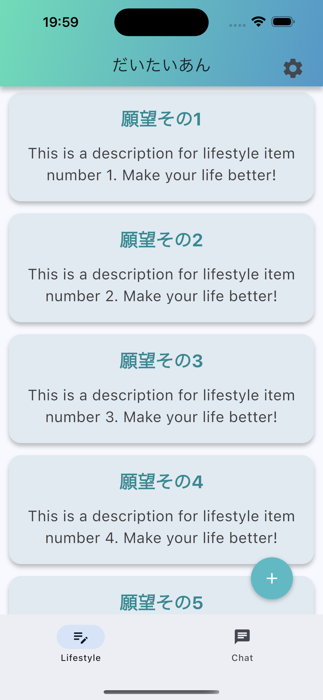
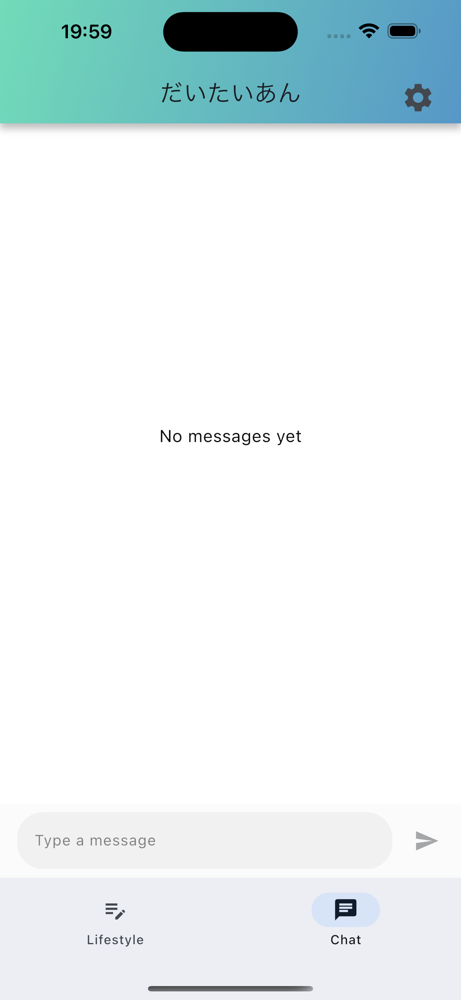
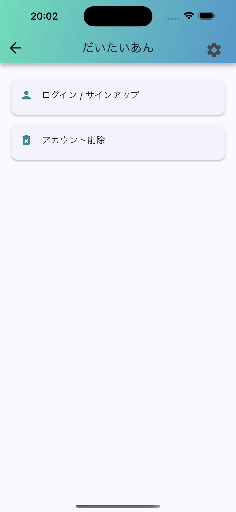

# 個人開発アプリ 「 だいたいあん 」
 
 
 
 
 
 
 
 
 

                     理想の自分への選択肢を提案する AI Agent アプリ

---

# 自己紹介

 

- 名前 : yamamomo
- Flutter 大学 : 2024/12/26 ~  
- 経歴(予定を含む)
     2023/4 ~ 2025/8 : 製造業
     2025/9 : 夏休み
     2025/10 ~ : スマホアプリエンジニア
- 言語
Python, C#, Dart

---

# 共同開発に参加した！

 

### 経験したこと
- 新規入力モーダルの実装
- 多言語対応 (一部)
- Riverpodへの移行(１つのクラスだけ!)

ので、その経験を活かしたい！

--- 

# やったこと・進行中のこと

 

- 状態管理を Riverpod に移行した。
- 画面遷移を Go_Routor に移行した。
- 認証周りの改修 (進行中)
- UI の改修 (進行中)
- バックエンド (Genkit) の改修 (進行中)

---

# 現状

 

